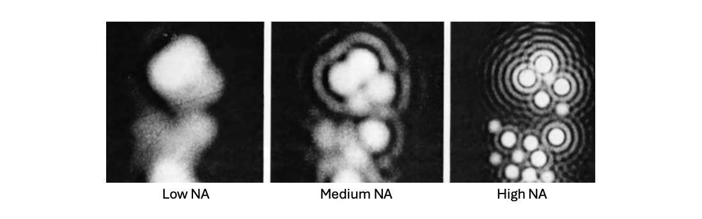
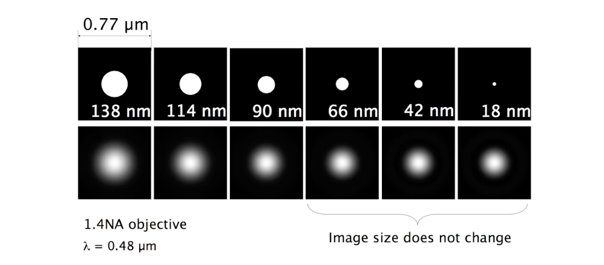
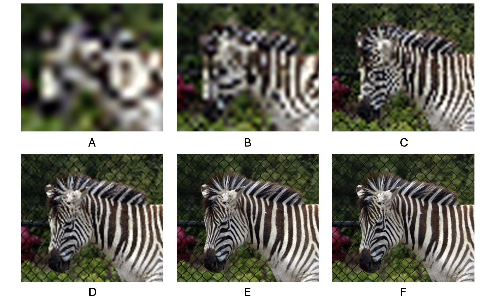
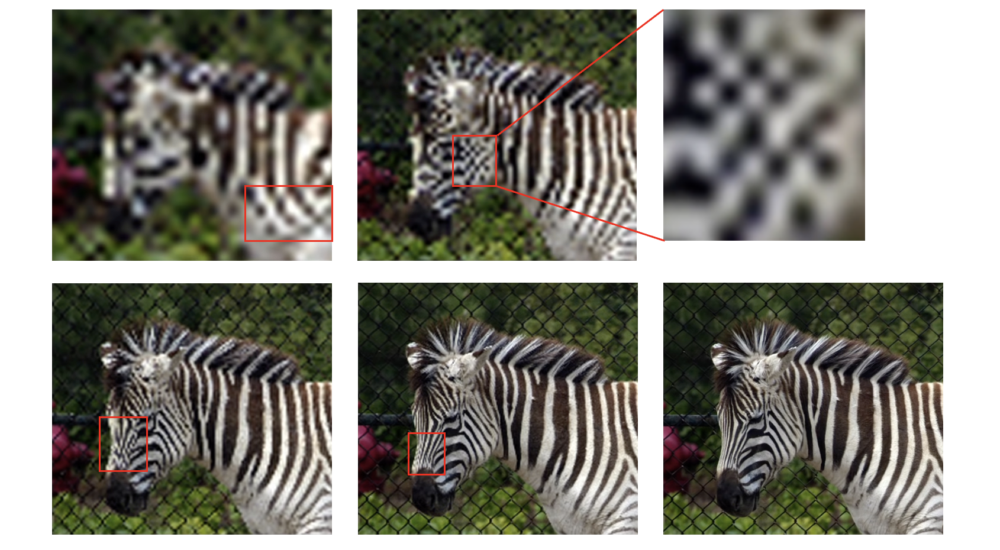
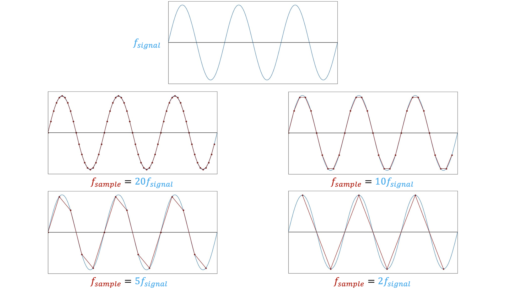
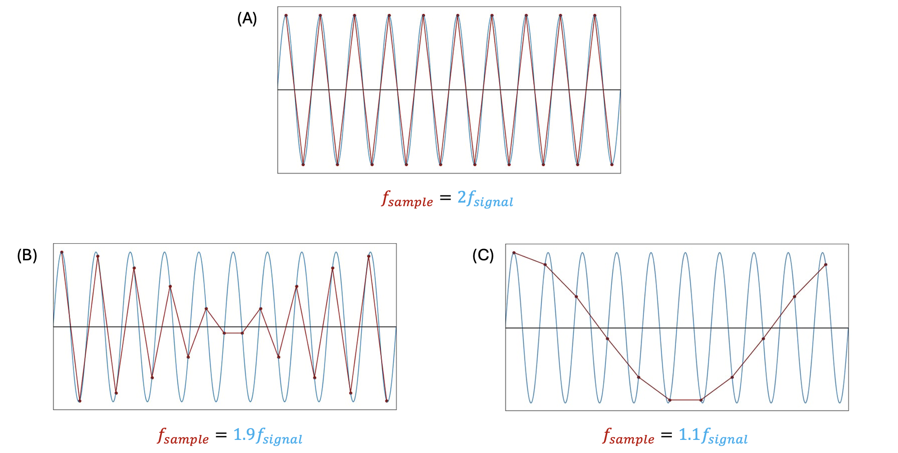

## Rayleigh Criterion

How close can two equal point sources be and still be seen as two separate points? There are many criterion for this, such as sparrow criterion and HWHM criterion (usually used in astronomy), but most microscopists use the **Rayleigh criterion**, partly because the distance between two points is $0.61\frac{\lambda}{NA}$ ( $2n\frac{\lambda}{NA^2}$ in depth), which is equal to the radius of the first dark ring.

Rayleigh criterion[^1]


The higher the NA, the smaller the Rayleigh criterion, and the better the resolution.



Another thing to mention is that, say when imaging some small beads, if the beads are smaller than the resolution limit, the images you get are basically going to look the same, even though the beads get smaller and smaller.



There are tools that kind of break through this limitation, like **Super-Resolution Microscopy**, but this is the fundemental limit of resolution based on diffraction.



## Sampling

If you want to get the most out of the objective, you have to not only pay attention to the quality of the objective (like NA I've mentioned before), **but also the image itself has to have a grain to get the finest details**. Sometimes people have very fancy and expensive objectives, but they don't take images at sufficient resolution in the imaging plane to see all the details that actually exist there (like they don't use enough pixels/pixel size).

It's quite hard to tell what it is in panel A below, because it's a blurry image -- it's not been blurred, but just **been sampled with pixels that are too big to see the details**.

So let's move up by sampling with a higher grain in the imaging plane, like using more pixels in the same detector and the same camera. From panel B to F, you can see that the image gets clearer and clearer, and you can see more and more details.

## Aliasing

When moving up the sampling further and further, you may notice that the image has some **unusual features**: like some checkerboard of stripes I've boxed in the image below.

You may know enough about the zebras that they should not have these checkerboards actually; but as a researcher, you are imaging things that might not be looked at before, so if you see objects with some periodicity, you may believe that they are real, but **actually they are artifacts**. So, this actifact of sampling is called **aliasing**. This can severely crimp your ability to interpret your images.

## Nyquist-Shannon Sampling Theorem

But how do you know how much resolution you need / how to sample your image properly? This comes to the **sampling theorem**.



A continuous function can be completely represented by a set of equally spaced samples, if the samples occur at **more than** <mark>**twice**</mark> the frequency of the highest frequency component of the function.



In other words, to capture a function with maximum frequency $F_{max}$, you need to sample it at frequency $N=2F_{max}$. $N$ is called the **Nyquist limit/Nyquist rate**.

We can think of this theory in the time domain. Say the signal we want to sample is a sine wave (blue), and each point (red) represents a sampling instant. We reconstruct the signal by connecting the points with straight line. When the sampling frequency is higher than the Nyquist rate, as we reduce the sampling frequency, the shape of the straight-line approximation diverges from the original sine wave; but we can still clearly see that the frequency of the reconstructed signal is the same as the original signal, so **the cyclic nature of the signal is preserved**.

20/10/5/2 samples per cycle[^2]

However, when the sampling frequency continues going down and drops below the Nyquist rate, we can see that the discrete-time waveform we reconstructed has acquired fundamentally new cyclical behavior, as shown below:

1.9/1.1 sample per cycle[^2]

In panel (B) & (C), when we sample at frequencies below the Nyquist rate, the original signal cannot be properly reconstructed, and **information is permanently lost**.

When the original signal is undersampled, i.e. the sampling theorem's condition is not satisfied, especially in the panel (C), wrong reconstruction can be interpolated from the samples, and **aliasing occurs**. 

So the reason why you see the checkerboard in the zebra image is that **the sampling resolution, or pixel density, is inadequate**, which creates a fake pattern in the image whose frequency is much more lower than the real pattern.

[Moiré pattern](https://en.wikipedia.org/wiki/Moir%C3%A9_pattern) is also caused by aliasing.

## Reference

Microscopy: Resolution (Jeff Lichtman) - Youtube:



[^1]: [How the point spread function influence microscopy resolution? | SIMTRUM Photonics Store](https://www.simtrum.com/WebShop/ResourceInfo.aspx?id=4444)
[^2]: [The Nyquist–Shannon Theorem: Understanding Sampled Systems](https://www.allaboutcircuits.com/technical-articles/nyquist-shannon-theorem-understanding-sampled-systems/)
