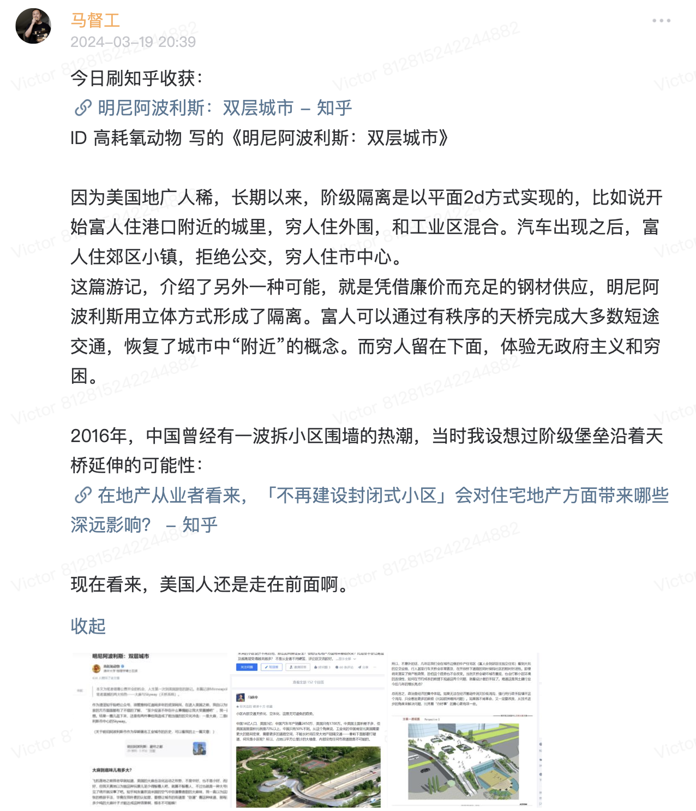

## 所谓“双层城市”

马督工分享的有关双层城市的想法


是的，明尼阿波利斯这个城市它居然是双层的！地面那层有公交、轻轨、大麻、必胜客和神志不清的bro，天上那层有干净的餐馆、正统的本地白人居民、有自带持枪保安的商场超市和银行、有法律学校的招生广告。而你来到这里的前三天一直在地上那层打转，还纳闷这明尼阿波利斯凭啥在全美的宜居城市里名列前茅。  透过Skyway的玻璃向下望，此起彼伏的警笛声依然不停歇，嗑嗨了的黑bro们仍然在街上迈着诡异的步伐，但你和这一切之间已经隔开了一层令人感到舒适的厚玻璃了；从你身边经过的不再是散发着大麻味、健康状况堪忧的流浪汉，而是一位位衣着得体、不瘦也不过胖的白人中产。  你从酒店还是可以花20分钟走到会场，但是这二十分钟里你一点儿外面的冷风也不用吹，一点儿大麻味也不用闻。Skyway回答了你一个心里好几天的疑惑——密西西比河边那么多跑步的人，但城里通向河边的大街上却看不到几个，他们是怎么到达河边的呢？这流量不太守恒呀？现在你懂了，Skyway直通河边绿地，狡猾的本地人从天上就过去了。  我于是意识到，这些天来开会的会场其实是属于明尼阿波利斯的“天上那层”的——会场里有一万名搞物理的科研人，但是黑人的数量一只手就能数得过来。报告厅里空气清新，往来的人与我在“地上那层”随处可见的被大麻腌入味儿了的黑人白人们一点儿都不一样。  所有中国人听我们讲到这个skyway的桥段，第一个问题一定是：“那他们homeless们为啥不上去？” 我们能知道的是天桥们普遍会在晚上十点后关门，而流浪汉们最活跃的时间是在晚上，我们还知道商场里有持枪的保安看着大家，但所有这一切都不能解释流浪汉们为啥不上去，毕竟下面是那么冷那么乱，而上面又暖和又干净。...来美国的前几天我越来越搞不懂很多人为什么想润这个地方，毕竟吸过大麻之后，连北京的雾霾都变得香甜了起来。但呆了几天之后，我的潜意识里就开始有一些额外的弯弯绕了——  已知：1. 我早上会来密西西比河边跑步，2. 那些走在skyway里的人早上也会来密西西比河边跑步，将1 2 两式联立，那么“我”和那些“走在skyway里的人”本质上不就是一类人了吗？   **“我”如果润来了明尼阿波利斯，岂不是也能住在城市的上层吗？再等“我”花个几万美刀买辆车，不是也就能跟“地面那层”之间永远地隔着一层玻璃了吗？那“我”不就可以一直生活在这个干净整洁的万达广场里了吗？**   一切听起来都非常的合理，只要“我”不去思考bro们用大麻和尿骚味占领“天上那层”的可能性。退一步讲，就算bro们占领了连通城市二层的skyway，那“我们”不还是有第三层吗？三层被攻陷了还有四层，层层叠叠无穷匮也！  当然还有另一种可能，那就是Skyway失守是只有中国人会担心的问题，我其实是来自中国的杞人，替美国人忧天。毕竟，美国人对skyway最严重的指控也不过是担忧“天上那层”挤垮了“地面那层”的商业，但在俺这种中国人看来，正经的商业，不管是超市咖啡厅还是银行，早都被“天上那层”收入囊中了，实在是不懂他们美国人在担心什么。跨种族的互相理解果然要费一番工夫。



但是，中国同时也是一个阶级分化严重的国家。在一线城市上百万以千万人民币当做房产价格单位，把万当做月薪单位的时候，中国大多数县城青年还需要争抢月薪2000带社保的工作。在刚刚过去的2015年，中国人买走了全世界46%的奢侈品，同时全国居民人均可支配收入中位数只有19281元。在这样一个国家里，穷人和富人对生活的预期本来就不一样，必然会产生分离居住的需求。   **在无法消灭阶级差异的前提下** ，强行要求穷人和富人的生活空间混合，只能迫使双方都用更高的成本来搭建适合自己居住的空间。...西方国家怎么解决这个问题呢？一般是通过房产税来“解决”这个问题。你住在平均房价高的街区，但现金收入不足以应付每年1%或者2%的房产税，自然会卖掉房子搬到低税率地区；反过来说，住在低税率地区的高收入者会有很多收入盈余，足够他买下高房价地区的地产。这样，房产税天然地分割了穷人和富人的生活空间，还能从富人手里收到足够的钱改善交通基础设施——当然富人从新增设施中获得的便利更多。政府要打破富人区的布局新修道路，除了要赔钱外，也会顾虑房产价格下降会压低房产税，影响财政，所以不太容易出现中国最近的争议。...  除了少数拆迁暴发户之外，大多数拆迁户的现金收入其实低于新来的购房者，对小区物业、小区环境、物业费压力的看法和新来的购房者不同，容易因为物业费和小区环境产生争执，这就是为什么中产购房者不愿买回迁房比例高的小区的原因。现在要让小区去掉围墙，让公共空间和业主空间连通，在一定程度上就是给许多居民区带来了“拆迁户”效应，自然会激发矛盾。...怎么解决这个矛盾呢？其实几十年前类似的阶层矛盾就制造过类似的问题——工矿家属区为了方便管理，为了避免家属区之外的居民也分享家属区的福利，往往会用墙把家属区圈起来...  所以，不意外的话，几年后我们会在城市边缘的中产住宅区（富人会到郊区住独立住宅）看到大批的立交设施，行人甚至行车天桥会非常普及，在开放桥下道路的同时保持社区的相对封闭性...  总而言之， **政治是经济的集中体现。如果无法在经济基础中消灭阶级鸿沟，强行用行政手段填平这个鸿沟，只会惹出更多的麻烦** （比如欧洲难民问题）。如果既不肯革命，又一定要改良，从技术进步的角度来解决问题，比凭着“办好事”的善心更有效一些。


## 我的想法

这篇游记我看完之后感触特深。因为我去年暑假也去了美国纽黑文一趟，那是我第一次去美国，在那做暑期科研实习，呆了三个多月。纽黑文治安是属于美国极差的那一档的，当时一过去之后感受到很大的文化冲击，我好几天没缓过来：到那的第一天，华人房东就开车带我们在不同街区转，指哪条街不安全、什么时候不能来，当时被震惊了。

一是震惊于市区的混乱、有些地方到处都是大麻味，这和我之前对于美国的想法不太相符；

二是震惊于“割裂感”，哪些区域（精确到街道路口）安全不安全，就好像是大家都“约”好了似的，我住的地方偏郊区，黑人或者无家可归的都几乎见不到，大家也好像一点都不觉得不安全，相反市区的大草坪我去都不敢去，公交我都没坐过（因为听说会被抢劫），西部那些黑人聚居的区域我更是不敢去，只敢坐校车通勤（简直就是一种全方位立体隔离），我也从来没在免费开放的博物馆、校园的一部分见过homeless；

三是当时我也产生了怀疑，为什么美国现状这样，还有那么多人想润过去？但是后来我想通了，像“我”一样或者比“我”阶层更高的人，润过去就是在那“skyway”，每天遇到的也就是和蔼可亲的中上层，“我”只要努努力、买个车，在美国就可以永远呆在那个“郊区”、“城市的上层”。 **有时很多人润不是因为别的，只是恨自己不在那个“天上那层”罢了。等他们到了那个“天上那层”，他们也会一样想着如何维持现状、方便自己、防止别人触动他们的利益。** 当然，我当时过去，也算是生活在那样的环境里了。

## 推荐链接

- [如何看待「新建住宅要推广街区制，原则上不再建设封闭住宅小区」这一政策？](https://www.zhihu.com/question/40611359/answer/87431342)
- [在地产从业者看来，「不再建设封闭式小区」会对住宅地产方面带来哪些深远影响？](https://www.zhihu.com/question/40633509/answer/88911504)

（一个有点无关的链接。。）

- [为什么有很多名人让人们警惕人工智能？](https://www.zhihu.com/question/27864852/answer/85241611)