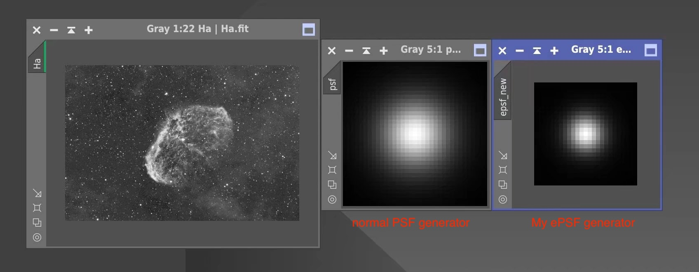

This script generates an ePSF (effective Point Spread Function) from a FITS image by detecting stars, extracting cutouts, and building a PSF model. The output is saved as a FITS file.

## What is ePSF?

Basically, the ePSF is the true PSF that you'd measure from actual images.

## Code

You can simply download code [here](https://github.com/ZhenHuangLab/epsf_generator/tree/main).

## Usage

To run the script, use the following command:

```bash
epsf_generator [-h] -i IMAGE [-n NUMBER] [-f FWHM] [-s SIZE] -o OUTPUT
```

## Required Arguments


`-i` or `--image`: path to FITS image

`-o` or `--output`: path to output ePSF FITS file


## Optional Arguments


`-n` or `--number`: maximum number of stars to use for ePSF model (default is 100)

`-f` or `--fwhm`: FWHM (full-width at half-maximum) of stars in pixels (default is 5.0)

`-s` or `--size`: size of cutout in pixels around detected stars (default is 25)

`-h` or `--help`: show help message and exit


## Example

Create an ePSF from an input FITS image and save it as a FITS file:

```bash
epsf_generator -i input.fits -o output.fits
```
This will generate an ePSF from the input.fits image with default parameters and save it as `output.fits`.

